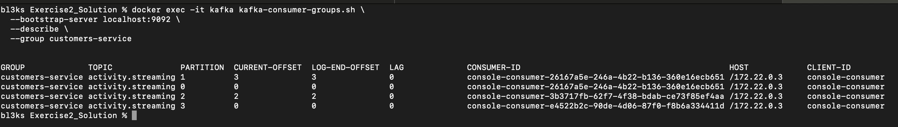

# Part 1 — Environment Setup and Kafka Basics

## Environment Setup

### Step 1: Start the environment

The environment was started using Docker Compose to run all required services in isolated containers.

```bash
docker compose up -d
```

### Step 2: Verify running containers

```bash
docker ps
```

This confirmed that the following services were running:

* PostgreSQL
* Apache Kafka
* Kafka UI
* Kafka Connect

This setup is required for both Kafka basics and Change Data Capture (CDC).

### Conclusion

At this point, the full infrastructure was ready and running correctly.

---

## Accessing PostgreSQL

### Step 1: Access PostgreSQL inside the container

```bash
docker exec -it postgres psql -U postgres
```

### Step 2: Create and select the database

```sql
CREATE DATABASE activity;
\c activity
```

### Step 3: Create a table

```sql
CREATE TABLE activity (
  id SERIAL PRIMARY KEY,
  name VARCHAR(255) NOT NULL,
  email VARCHAR(255)
);
```

### Conclusion

A database and table were created to simulate application data that will later be streamed using CDC.

---

## Kafka Topic Creation and Inspection

### Step 1: Create a Kafka topic

```bash
docker exec -it kafka kafka-topics.sh \
  --bootstrap-server localhost:9092 \
  --create \
  --topic activity.streaming \
  --partitions 4 \
  --replication-factor 1
```

This command successfully created the topic `activity.streaming`.

### Step 2: List topics

```bash
docker exec -it kafka kafka-topics.sh \
  --bootstrap-server localhost:9092 \
  --list
```

This showed that `activity.streaming` exists.

### Step 3: Describe the topic

```bash
docker exec -it kafka kafka-topics.sh \
  --bootstrap-server localhost:9092 \
  --describe \
  --topic activity.streaming
```

This showed:

* 4 partitions
* replication factor of 1
* all partitions assigned to the broker

### Step 4: Inspect topic configuration

```bash
docker exec -it kafka kafka-configs.sh \
  --bootstrap-server localhost:9092 \
  --entity-type topics \
  --entity-name activity.streaming \
  --describe
```

The output showed no custom configuration.

### Conclusion

Kafka topics store events in partitions, allowing parallel consumption and scalability.

---

## Producing and Consuming Messages

### Step 1: Produce messages

```bash
docker exec -it kafka kafka-console-producer.sh \
  --bootstrap-server localhost:9092 \
  --topic activity.streaming
```

Messages sent:

```json
{"id":1,"name":"Alice"}
{"id":2,"name":"Bob"}
```

### Step 2: Consume messages from the beginning

```bash
docker exec -it kafka kafka-console-consumer.sh \
  --bootstrap-server localhost:9092 \
  --topic activity.streaming \
  --from-beginning
```

This displayed the messages that were produced.

### Conclusion

Kafka stores messages durably and allows consumers to replay data from the beginning.

---

## Consumer Groups and Offsets

### Step 1: Start a consumer with a consumer group

```bash
docker exec -it kafka kafka-console-consumer.sh \
  --bootstrap-server localhost:9092 \
  --topic activity.streaming \
  --group customers-service
```

### Step 2: Inspect consumer group state

```bash
docker exec -it kafka kafka-consumer-groups.sh \
  --bootstrap-server localhost:9092 \
  --describe \
  --group customers-service
```

This showed:

* partitions assigned to consumers
* current offsets equal to log end offsets
* lag equal to zero



### Conclusion

Consumer groups allow Kafka to track progress and scale consumers while ensuring no message is processed twice.

---

## Part 1 Summary

This section covered Kafka fundamentals:

* topics and partitions
* producers and consumers
* consumer groups and offsets

These concepts are required to understand CDC with Debezium.

---

# Debezium CDC with PostgreSQL and Kafka

## Verifying Kafka Connect

Kafka Connect plugins were checked using:

```bash
curl http://localhost:8083/connector-plugins
```

This confirmed that the PostgreSQL Debezium connector was available.

### Conclusion

Kafka Connect was correctly set up and ready to run Debezium.

---

## Registering the Debezium Connector

The PostgreSQL Debezium connector was registered using the Kafka Connect REST API.

After registration, the status was checked:

```bash
curl http://localhost:8083/connectors/activity-connector/status
```

The connector and its task were both in the `RUNNING` state.

### Conclusion

Debezium was successfully connected to PostgreSQL and started monitoring database changes.

---

## CDC in Action

### Step 1: Insert data into PostgreSQL

```sql
INSERT INTO activity (name, email)
VALUES ('Alice', 'alice@example.com');
```

### Step 2: Consume CDC events

```bash
docker exec -it kafka kafka-console-consumer.sh \
  --bootstrap-server localhost:9092 \
  --topic dbserver1.public.activity \
  --from-beginning
```

The consumed message contained:

* the `after` field with inserted data
* operation type `op = "c"` (create)

### Conclusion

Database changes were streamed into Kafka in real time without querying the table.

---

# Activity 2 — Temperature Logging System

## Port Issue and Fix

The default PostgreSQL port `5432` was already in use on the local machine.
To avoid conflicts, PostgreSQL was exposed as:

* container port: `5432`
* host port: `4343`

All Python scripts were configured to use port `4343`.

---

## Architecture Choice

Because the system has:

* low data volume
* one consumer
* no real-time requirement

Kafka was not used. The consumer reads directly from PostgreSQL every 10 minutes.

### Conclusion

For small workloads, direct database access is simpler and more efficient.

---

## Implementation

### Step 1: Create Python environment

```bash
cd Activity2
python3 -m venv sbdvenv
source sbdvenv/bin/activate
pip install psycopg
```

### Step 2: Run producer

```bash
python temperature_data_producer.py
```

You observed:

```text
Database mydb already exists.
Table ready.
Inserted temperature values every minute
```

### Step 3: Run consumer

```bash
python temperature_data_consumer.py
```

You observed:

```text
Average temperature last 10 minutes: 25.78 °C
```

### Conclusion

The producer inserts data periodically, and the consumer computes averages using SQL. This meets the requirements with minimal complexity.

---

# Activity 3 — Real-Time Fraud Detection

## Architecture Overview

This activity required:

* very high data volume
* multiple consumers
* near real-time processing

Architecture used:

* PostgreSQL as system of record
* Debezium for CDC
* Kafka for event streaming
* multiple independent consumer agents

---

## Setup

### Step 1: Create Python environment

```bash
cd Activity3
python3 -m venv sbd3venv
source sbd3venv/bin/activate
pip install psycopg2-binary kafka-python
```

---

## Transaction Producer

### Step 1: Run producer

```bash
python fraud_data_producer.py
```

You observed continuous output:

```text
Inserted 1000 transactions...
Inserted 1000 transactions...
```

This simulates a high-throughput OLTP system.

---

## CDC with Debezium

Debezium captured inserts on the `transactions` table and published them to:

```text
frauddb.public.transactions
```

### Conclusion

PostgreSQL changes were streamed into Kafka in near real time without polling.

---

## Fraud Detection Agents

Two Kafka consumers were started in **different consumer groups**, allowing parallel processing.

### Agent 1: Behavioral Anomaly Detection

* tracks user spending history
* flags unusually large transactions

### Agent 2: Velocity and Heuristic Detection

* detects rapid transaction bursts
* flags high-value transactions

Both agents consumed the same topic independently.

---

## Final Conclusion

Across all activities:

* Kafka basics showed how events are stored and consumed
* Debezium CDC showed how databases can produce real-time event streams
* Activity 2 showed that simple problems do not need streaming
* Activity 3 showed why CDC + Kafka is necessary for high-scale, real-time systems

Using port `4343` solved local PostgreSQL conflicts without changing the overall architecture.

This exercise demonstrated how architectural choices depend on data volume, latency needs, and number of consumers.