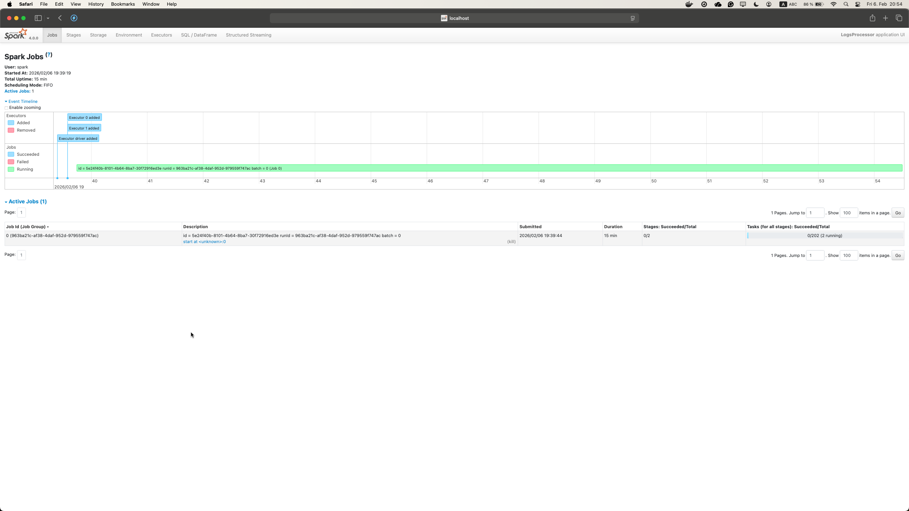
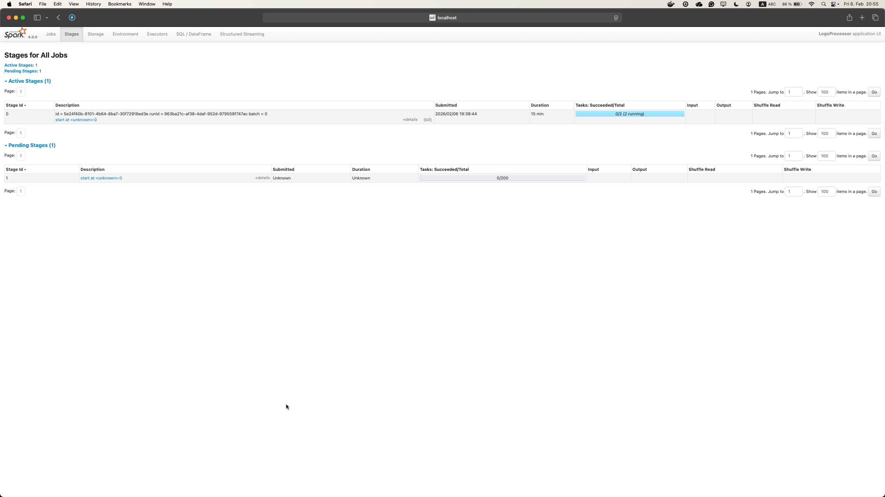
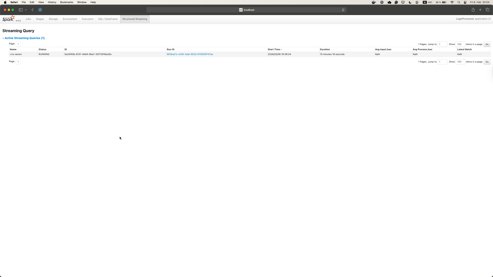

# SBD3 - Distributed Stream Processing

This report documents my **second attempt** at the Spark Structured Streaming assignment.  
In the first attempt, I managed to complete Activities 1 and 2, but Activity 3 could not be finished due to infrastructure and runtime issues.  

The goal of this second attempt was to **redo the whole exercise from scratch**, understand what went wrong before, and correctly implement all activities, especially Activity 3, in a stable and reproducible way.
To avoid the issues from the first attempt, the entire Docker environment was reset and rebuilt.

---

## Activity 1 – Understanding Spark Execution

### What Was Done:

A Spark Structured Streaming application was submitted from the `spark-client` container using `spark-submit`.  
The Spark Driver Web UI at http://localhost:4040 was used to monitor execution.

Each micro-batch triggered a Spark job, which could be observed in the Jobs tab.

### Observations

- Spark Structured Streaming runs using micro-batches
- Each micro-batch appears as a Spark job
- Jobs are composed of multiple stages
- Simple operations like parsing and filtering happen in early stages
- Aggregations introduce shuffle and stateful stages

#### Bottleneck:
From the Stages tab, the longest-running stages were those involving shuffle and state management.

This confirmed that shuffle operations are the main performance bottleneck in streaming applications.

---

## Activity 2 – Performance and Scalability

### Baseline Configuration

The initial configuration was:
- 1 executor
- 1 core per executor
- 1 GB memory

This setup underutilized the available CPU resources.

### Improvements

By increasing:
- number of executors
- executor cores
- shuffle partitions

the application was able to process data faster and keep up with higher input rates.

### So?

Spark Structured Streaming scales mainly through parallelism.  
More executors and cores reduce shuffle pressure and improve throughput while keeping micro-batch latency low.

---

## Activity 3 – Monitoring User Experience in Near Real-Time

### What Failed in the First Attempt

In the first attempt:
- the streaming job was unstable
- Docker networking caused issues between Spark and Kafka
- no reliable Web UI evidence could be produced
- event-time logic was difficult to verify

---

### What Was Fixed in the Second Attempt

In this attempt:
- the environment was rebuilt from scratch
- Spark Driver UI was used instead of Spark Master UI
- event-time processing was implemented correctly
- watermarking was added
- checkpoints were configured

This resulted in a stable and observable streaming application.

---

### Implementation Logic

The application:
- reads log events from Kafka
- filters events containing the word `"crash"` (case-insensitive)
- keeps only events with severity `High` or `Critical`
- converts timestamps to event time
- applies a 30-second watermark
- aggregates events per `user_id` in 10-second windows
- outputs results only when the crash count is greater than 2

---

### Validation Using Spark UI

The Structured Streaming tab confirms that the query is running continuously.

This proves:
- the application is a Structured Streaming query
- event-time processing is active
- micro-batches are executed continuously

---

## Fault Tolerance and Scalability

Fault tolerance is handled through:
- Spark checkpointing
- Kafka’s durable log
- Spark’s ability to reassign executors

Scalability is supported by increasing executors, cores, and partitions, allowing the application to run on multiple machines if needed.

---

## Conclusion

Main challenges across both attempts:
- Docker container networking
- confusion between Spark Master UI and Spark Driver UI
- lack of visible output when thresholds were not met
- unstable container states after restarts

Turns out most problems were **operational**, not related to Spark logic itself.  
Once the environment was clean and the correct UI was used, the application behaved as expected.

Redoing this helped me better understand both Spark theory and the practical challenges of running streaming systems in containerized environments, which turned out to be some how not really hard if done the right way :)